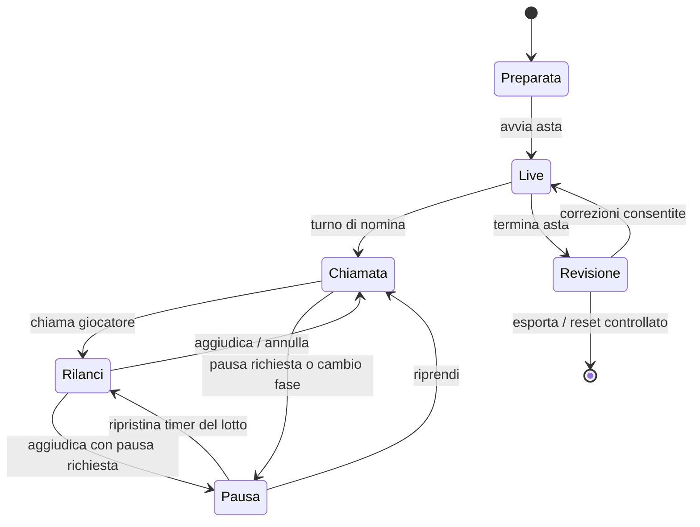

# Fantacalcio · Webapp asta live

Documentazione funzionale, tecnica e operativa della webapp per la gestione di leghe e aste Fantacalcio.

> Stato documentato: **3 settembre 2026**  
> Repository: **`emanuelesordo/fantacalcio`**  
> Ramo di pubblicazione: **`main`**  
> Pagina canonica: **`home.html`**  
> Backend: **Supabase · PostgreSQL · Edge Functions**

---

## 1. Scopo del progetto

L'applicazione copre l'intero ciclo operativo di una lega:

1. accesso degli utenti;
2. creazione o ingresso in una lega;
3. assegnazione dei ruoli e delle squadre;
4. configurazione Classic o Mantra;
5. importazione del listone e dei dati statistici;
6. preparazione dell'asta;
7. chiamate, code, rilanci, timer e aggiudicazioni in tempo reale;
8. gestione e correzione delle rose;
9. chiusura dell'asta, riepilogo ed esportazione.

La priorità progettuale è consentire un'asta utilizzabile per molte ore, su schermi e dispositivi differenti, senza perdere il controllo dello stato condiviso. Il server è sempre la fonte autorevole; il browser ottimizza reattività e continuità visiva.

---

## 2. Contratto architetturale

### 2.1 Un solo file applicativo

La versione corrente è intenzionalmente **monolitica**:

- markup HTML;
- stile CSS;
- logica JavaScript;
- hash routing;
- chiamate alle API;
- rendering delle viste;
- adattamento responsive;

sono contenuti in **`home.html`**.

Non esiste una fase di build e non sono richiesti bundler, package manager o framework JavaScript. GitHub Pages può servire direttamente il file.

Nel repository possono essere presenti file `.html`, `.js` e `.css` precedenti o di appoggio. Non rappresentano la pagina canonica e non devono essere ricomposti nella distribuzione corrente senza una migrazione intenzionale.

### 2.2 Frontend statico, backend controllato

Il browser non contiene credenziali privilegiate e non scrive direttamente nelle tabelle PostgreSQL. Tutte le operazioni applicative passano attraverso Supabase Edge Functions:

```text
Browser · home.html
        │
        ├── simple-auth
        ├── leagues-api
        ├── onboarding-api
        ├── league-api
        ├── list-api
        ├── rosters-api
        └── auction-api
                │
                └── PostgreSQL / RPC / transazioni
```

Il token di sessione applicativo identifica l'utente. L'Edge Function verifica sessione, ruolo, lega e permesso prima di operare con le credenziali server-side.

### 2.3 Fonte autorevole dello stato

Per ogni asta lo stato autorevole è salvato nel database. Il frontend conserva solo:

- sessione locale;
- preferenze visive;
- filtri;
- selezioni temporanee;
- stato ottimistico della coda;
- offset temporale fra browser e server;
- firme di rendering per evitare ridisegni inutili.

Un refresh della pagina deve quindi ricostruire l'interfaccia leggendo il server, senza dipendere da variabili JavaScript precedenti.

---

## 3. Avvio e pubblicazione

### 3.1 GitHub Pages

La pagina pubblica prevista è:

```text
https://emanuelesordo.github.io/fantacalcio/home.html
```

Le viste sono selezionate tramite hash e non richiedono regole di rewrite del server:

```text
home.html#/leagues
home.html#/home
home.html#/manage
home.html#/setup
home.html#/list
home.html#/rosters
home.html#/auction
home.html#/tv
```

### 3.2 Requisiti runtime

- browser moderno con JavaScript abilitato;
- accesso HTTPS al progetto Supabase;
- `localStorage` disponibile per la sessione;
- Fullscreen API opzionale per la modalità immersiva;
- Canvas e download Blob per esportazioni PNG/CSV.

### 3.3 Controlli prima della pubblicazione

Ogni modifica a `home.html` dovrebbe superare almeno:

1. controllo sintattico del JavaScript inline;
2. apertura della pagina senza errori in console;
3. accesso e validazione della sessione;
4. navigazione di tutte le hash route;
5. prova asta con una sessione test;
6. prova responsive desktop, tablet e smartphone;
7. verifica dei permessi Presidente, Vice, Banditore, Admin e Presentatore;
8. verifica che il backend rifiuti le operazioni vietate anche se invocate fuori dalla UI.

---

## 4. Routing e struttura delle viste

Il routing è interamente client-side. `window.location.hash` viene normalizzato, validato rispetto ai permessi e convertito nella vista attiva.

| Hash | Vista | Scopo |
|---|---|---|
| `#/leagues` | Leghe | Selezione lega, creazione, ingresso e richieste |
| `#/home` | Home lega | KPI, squadre, ruolo personale e approvazioni |
| `#/manage` | Membri e squadre | Amministrazione squadre, ruoli e richieste Vice |
| `#/setup` | Setup | Regole della lega, rosa, timer, chiamate e ordine ruoli |
| `#/list` | Listone | Consultazione, filtri, ordinamento e indicatori statistici |
| `#/rosters` | Rose | Vista delle squadre e delle assegnazioni |
| `#/auction` | Asta | Cockpit operativo dell'asta live |
| `#/tv` | TV | Vista semplificata per proiezione/presentazione |

`resolveRoute()` impedisce di aprire viste non consentite e `defaultRoute()` sceglie una destinazione coerente con sessione e lega selezionata.

---

## 5. Accesso, sessioni e autorizzazioni

### 5.1 Login applicativo

L'accesso non usa il form Supabase Auth standard. È un'autenticazione applicativa con:

- username normalizzato;
- password conservata esclusivamente come hash nel database;
- token di sessione opaco restituito al browser;
- solo hash del token conservato server-side;
- scadenza, revoca e data di ultimo utilizzo;
- validazione della sessione al riavvio dell'app.

Il token è salvato nel `localStorage` sotto la chiave:

```text
fantacalcio_session
```

Il frontend aggiunge `sessionToken` alle richieste Edge. Alla scadenza o revoca, la sessione locale viene cancellata e ricompare il gate di login.

### 5.2 Ruoli applicativi

| Ruolo | Ambito | Funzioni principali |
|---|---|---|
| Super Admin | Globale | Controllo globale, dati riservati, amministrazione completa |
| Admin lega | Lega | Setup, membri, squadre, import, preparazione e correzioni |
| Presidente | Squadra | Chiamate, coda, rilanci, rosa, stato “A POSTO” |
| Vice | Squadra | Segnali di supporto al Presidente durante l'asta |
| Banditore | Lega/asta | Regia completa, timer, offerte vocali, aggiudicazioni e correzioni |
| Presentatore | Lega/asta | Vista TV e comunicazione pubblica dello stato |

Un utente può avere più ruoli. I controlli visibili sono derivati dai permessi restituiti dal server, ma la sicurezza non dipende dal fatto che un bottone sia nascosto: ogni azione viene nuovamente autorizzata nell'API.

### 5.3 Principio del minimo privilegio

- Il browser possiede solo il token applicativo.
- La `service_role` resta nelle Edge Functions.
- Le funzioni PostgreSQL sensibili non sono eseguibili da `public`, `anon` o `authenticated` quando sono pensate per il solo backend.
- La validazione server-side è obbligatoria anche per vincoli già rappresentati nell'interfaccia.

---

## 6. Ciclo di vita della lega

### 6.1 Creazione e ingresso

Un utente può:

- creare una lega;
- cercarla tramite codice;
- richiedere uno o più ruoli;
- associarsi a una squadra esistente;
- proporre una nuova squadra quando consentito.

Le richieste hanno uno stato esplicito e devono essere approvate dagli utenti autorizzati. Le approvazioni personali vengono aggiornate automaticamente.

### 6.2 Membri e squadre

La vista di gestione permette di:

- creare squadre;
- assegnare il Presidente;
- concedere o revocare ruoli di lega;
- approvare membri;
- approvare il Vice da parte del Presidente;
- mantenere separati ruolo di lega e appartenenza a una squadra.

### 6.3 Setup completato

L'asta può essere preparata solo quando setup, squadre e listone sono coerenti. Il backend deve rifiutare configurazioni impossibili, indipendentemente dalle convalide HTML.

---

## 7. Setup della lega

### 7.1 Formato Classic

Il numero di slot è definito per macro-ruolo:

- `P` — Portieri;
- `D` — Difensori;
- `C` — Centrocampisti;
- `A` — Attaccanti.

Nella “Mia rosa” gli slot Classic si distribuiscono lungo tutta l'altezza disponibile. Gli spazi liberi rimangono visibili e consentono di percepire immediatamente la capacità residua.

### 7.2 Formato Mantra

Sono configurabili:

- portieri minimi e massimi;
- giocatori di movimento minimi e massimi;
- totale minimo e massimo.

La rosa parte dal numero minimo di righe e cresce fino al massimo quando acquisti effettivi o elementi della coda richiedono nuovi slot. I portieri obbligatori rimangono rappresentati anche se vuoti.

### 7.3 Modalità di chiamata

Il setup definisce:

- chiamata, lista o ordine casuale;
- base libera o quotazione;
- rilanci liberi o a turni;
- direzione oraria o antioraria;
- ordinamento del listone;
- modalità interfaccia Presidenti;
- timer della chiamata;
- penalità per chiamata non effettuata;
- ordine delle fasi ruolo.

### 7.4 Interfaccia Presidenti

| Modalità | Desktop/tablet | Smartphone |
|---|---|---|
| Standard | Un dispositivo contiene listone, coda, rosa e console rilanci | La UI si compatta mantenendo le funzioni consentite |
| PC + Smartphone | PC/tablet per chiamate, lista e rosa | Smartphone dedicato ai rilanci rapidi, libero, `OK` e `LASCIA/RIENTRA` |

La modalità PC + Smartphone riduce il rischio di chiamate involontarie durante un rilancio, ma non modifica i permessi server-side.

### 7.5 Timer rilanci

Il timer può essere:

- **fisso**, con una durata unica;
- **dinamico**, con fasce percentuali e secondi configurabili.

Le fasce dinamiche sono normalizzate e ordinate. La percentuale è calcolata rispetto ai crediti iniziali, secondo la logica server dell'asta. La configurazione deve contenere soglie coerenti e secondi positivi.

### 7.6 Timer chiamata

Il timer di chiamata può essere abilitato o disabilitato. Quando attivo dispone di:

- durata in secondi;
- penalità opzionale;
- numero di crediti da sottrarre al Presidente che non chiama.

Il database registra separatamente crediti spesi in acquisti e crediti di penalità, così il calcolo rimane verificabile.

### 7.7 Ordine dei ruoli

Opzioni previste:

**Mantra**

- libero;
- portieri prima, poi movimento.

**Classic**

- libero;
- `P → D → C → A`;
- `A → C → D → P`;
- `P → libero`.

L'ordine selezionato genera le fasi di chiamata dell'asta.

---

## 8. Listone e dati statistici

### 8.1 Dati base

Ogni giocatore può contenere:

- nome e forma normalizzata;
- squadra Serie A;
- ruolo Classic;
- uno o più ruoli Mantra;
- quotazione;
- slot;
- PMA;
- PFC;
- delta;
- fantamedia attesa;
- titolarità attesa;
- indicatori mercato, infortunio, nuovo arrivo e rigori;
- dati grezzi dell'import per tracciabilità.

### 8.2 Importazione

Gli import voluminosi sono suddivisi in tre passaggi:

1. `begin…Import` crea il batch;
2. `append…Import` invia blocchi di righe;
3. `finish…Import` valida e rende il dataset disponibile.

Questa strategia evita payload eccessivi, conserva lo stato del batch e permette di distinguere dati completati da caricamenti interrotti.

### 8.3 Filtri

Sono disponibili:

- ruoli;
- nome o squadra;
- squadra Serie A;
- slot;
- segnalazioni;
- ordinamento ascendente o discendente sulle colonne supportate.

I badge visuali derivano dai valori del filtro “Segnalazioni”, così filtro e tabella condividono lo stesso significato.

---

## 9. Macchina a stati dell'asta

L'asta non è una collezione di bottoni indipendenti: è una macchina a stati persistita.



Lo stato della sessione contiene, fra gli altri:

- giocatore corrente;
- squadra chiamante;
- squadra miglior offerente;
- offerta corrente;
- turno corrente;
- deadline e istante di partenza dei timer;
- pausa e hold;
- fase ruolo;
- versione incrementale;
- modalità test;
- timestamp di preparazione, avvio e chiusura.

La colonna/versione di sessione permette al frontend di capire se serve un ridisegno strutturale.

---

## 10. Fasi ruolo e comando “A POSTO”

### 10.1 Interpretazione funzionale adottata

La schermata distingue due responsabilità.

**Presidente**

- vede soltanto il proprio comando giallo `A POSTO · ruolo`;
- dopo averlo premuto vede `RIAPRI · ruolo`;
- può dichiararsi a posto solo dopo aver raggiunto il minimo previsto;
- viene considerato automaticamente completo al raggiungimento del massimo.

**Banditore/Admin**

- vede il nome e la posizione della fase;
- vede lo stato di tutte le squadre;
- controlla chi è pronto o completo;
- conferma il passaggio alla fase successiva;
- riprende l'asta dopo la pausa di transizione.

Il pannello completo non è duplicato nell'area del Presidente: si trova nella console Banditore.

### 10.2 Ruoli fuori fase

All'ingresso in una fase, i filtri ruolo si impostano automaticamente sui ruoli consentiti.

L'utente può attivare manualmente altri ruoli per consultare il listone, ma le righe fuori fase:

- sono visivamente attenuate;
- non possono essere inserite in coda;
- non possono essere chiamate;
- non diventano selezionabili per un'azione d'asta.

Il vincolo è duplicato volutamente:

1. controllo immediato nel frontend;
2. controllo autorevole nella funzione PostgreSQL che salva la coda.

Questo impedisce di aggirare la regola costruendo una richiesta HTTP manuale.

### 10.3 Passaggio di fase

Quando tutte le squadre sono a posto o hanno raggiunto il massimo:

1. l'avanzamento diventa disponibile al Banditore;
2. l'asta passa in pausa;
3. si possono effettuare riepiloghi e correzioni;
4. il Banditore dà il via alla fase successiva.

---

## 11. Cockpit dell'asta

### 11.1 Colonna “Mia rosa”

Contiene:

- squadra dell'utente;
- crediti e capienza residua;
- prezzo massimo sostenibile;
- numero minimo e massimo di giocatori ancora necessari/consentiti;
- spesa e medie;
- righe ordinate per ruolo;
- prezzo di acquisto;
- possibili acquisti della coda, se il flag privacy è attivo.

Il pannello occupa l'altezza disponibile. Le righe vuote e quelle potenziali si adattano senza creare un secondo listone sovrapposto.

### 11.2 Informazioni chiamata corrente

Il blocco centrale mostra:

- timer;
- nome del giocatore;
- badge ruolo accanto al nome;
- squadra e slot;
- offerta migliore e miglior offerente nello stesso riquadro.

In pausa il timer non espande la parola “PAUSA” sopra gli altri contenuti:

- `🔒` indica timer/asta bloccati;
- `⏳` indica sincronizzazione o attesa del secondo pulito;
- `—` indica assenza di timer applicabile.

Gli indicatori hanno `title` e `aria-label` descrittivi.

### 11.3 Console rilanci Presidente

La console include:

- incrementi rapidi `+1`, `+2`, `+3`, `+5`, `+10`;
- campo libero;
- `OK` per inviare il valore selezionato;
- `LASCIA` per disabilitare i rilanci sul giocatore corrente;
- `RIENTRA` per annullare un “lascia” errato;
- eventuali azioni `PASSA` o `ABBANDONA` in modalità a turni.

La selezione di un incremento non è di per sé un'offerta: il comando `OK` conferma l'importo.

### 11.4 Coda delle prossime chiamate

La coda:

- è personale per squadra;
- è scrollabile;
- supporta drag & drop;
- mostra ruolo, nome, base modificabile e rimozione;
- rispetta la capacità residua del ruolo;
- aggiorna immediatamente rosa potenziale e listone;
- viene poi sincronizzata con il server;
- effettua rollback e mostra un errore se il salvataggio fallisce.

Quando la coda è vuota, il pulsante sulla riga dello svincolato è `CHIAMA`: il giocatore entra comunque in coda e viene elaborato dalla medesima logica. Quando contiene già elementi, il pulsante è `CODA`.

### 11.5 Contiguità coda / ultimi rilanci

La colonna centrale usa una griglia verticale esplicita:

```text
informazioni chiamata
console rilanci
comando personale fase
coda flessibile
segnali Vice, se presenti
ultimi rilanci
```

Tra coda e ultimi rilanci non esiste uno spazio elastico: `gap` e margini strutturali sono azzerati. Se la fascia Vice non è usata viene rimossa dal layout, non mantiene una riga vuota.

### 11.6 Svincolati

La testata “Svincolati + conteggio” è eliminata per recuperare spazio verticale. La prima riga contiene ricerca e base; sotto sono presenti ruoli e filtri sulla stessa linea quando la larghezza lo consente.

La tabella mantiene, anche in spazi ristretti:

```text
ruolo | calciatore | badge | PFC | PMA | valore riservato | azione
```

La colonna riservata è visibile solo al Super Admin. Ruoli e nomi usano dimensioni basate sul contenuto per evitare sovrapposizioni.

### 11.7 Selezione dalla ricerca

Quando un giocatore viene selezionato:

- il nome resta nel campo di ricerca come riferimento;
- il filtro effettivo della lista viene pulito;
- tornano visibili tutti i giocatori compatibili con gli altri filtri.

---

## 12. Console Banditore

La console è collassabile sul lato destro ed è disponibile solo a Banditore/Admin autorizzati.

### 12.1 Regia del lotto

Contiene:

- squadre disposte in cubi uniformi;
- squadra offerente selezionabile;
- giocatore corrente o ricerca di uno svincolato;
- importo editabile;
- pulsanti `−` e `+`;
- rialzi rapidi `+1`, `+2`, `+3`, `+5`, `+10`;
- `OK · CONFERMA RILANCIO`;
- `AGGIUDICA`;
- `HOLD` quando previsto;
- annullamento dell'ultima offerta;
- annullamento dell'ultima assegnazione.

`OK` registra una variazione avvenuta a voce. Non aggiudica il giocatore.

### 12.2 Autorità del Banditore

Il Banditore può selezionare offerente e prezzo e aggiudicare anche a timer scaduto. Questa eccezione è server-side e non dipende dal contatore mostrato nel browser.

### 12.3 Pausa e ripresa

Il comando `PAUSA` imposta la richiesta di pausa. Se un lotto è in corso, la pausa operativa scatta dopo la conferma dell'aggiudicazione; non interrompe in modo ambiguo la transazione corrente.

Durante la pausa:

- i Presidenti possono gestire la coda;
- i timer restano fermi;
- il Banditore può correggere rose e assegnazioni;
- il Banditore può cercare uno svincolato e assegnarlo manualmente;
- `RIPRENDI` riattiva il ciclo.

### 12.4 Gestione chiamata

Comandi previsti:

- `TIMER`: ripristina il timer della fase corrente;
- `ANNULLA CHIAMATA`: rimette il giocatore fra gli svincolati, annulla gli effetti del lotto e conserva il turno al chiamante;
- `PASSA CHIAMATA`: avanza al Presidente successivo;
- `PAUSA/RIPRENDI`;
- `TERMINA ASTA`.

Il reset del timer usa il valore iniziale configurato. La partenza viene pianificata su un secondo intero condiviso dal server.

### 12.5 Ricerca manuale durante la pausa

La ricerca nella console propone solo giocatori attualmente svincolati. La selezione usa lo stesso insieme `callCandidates` restituito dal server; non è una ricerca libera su giocatori già assegnati.

### 12.6 Controllo fasi ruolo

La console contiene l'intero strumento di regia della fase:

- fase corrente e progresso;
- badge “in corso” o “completa”;
- stato di ciascuna squadra;
- avanzamento alla fase successiva.

Questo è il significato dell'annotazione “tool completo per console banditore”.

---

## 13. Timer e sincronizzazione multi-dispositivo

### 13.1 Tempo server

Il browser non decide quando scade un lotto. Il server restituisce:

- istante di partenza;
- deadline;
- durata configurata;
- ora server usata per calcolare un offset locale.

Il frontend calcola:

```text
ora stimata server = Date.now() + serverOffsetMs
secondi visibili = ceil((deadline - ora stimata server) / 1000)
```

### 13.2 Secondo pulito

Dopo reset, ripresa, nuova chiamata o nuova fase:

1. il server sceglie il prossimo secondo intero utile;
2. comunica `starts_at` e `deadline` a tutti i dispositivi;
3. fino a `starts_at` la UI mostra `⏳`;
4. al secondo intero compare il valore iniziale completo;
5. tutti i dispositivi scalano lo stesso valore.

Non si aggiunge un ritardo indipendente in ogni browser: sarebbe fonte di disallineamento.

### 13.3 Colori

Il timer usa colori molto visibili:

- oltre il 66%: verde;
- dal 66% al 33%: giallo;
- sotto il 33%: rosso.

### 13.4 Frequenze di aggiornamento

- il testo del timer viene ridisegnato localmente ogni **100 ms**;
- questo ridisegno non produce traffico di rete;
- durante un'asta live il server viene controllato circa ogni **500 ms**;
- viste amministrative e richieste usano refresh più lento;
- il listone non viene ricaricato inutilmente durante la consultazione.

---

## 14. Reattività e consistenza

### 14.1 Aggiornamenti mirati

Le parti ad alta frequenza sono:

- timer;
- offerta migliore;
- miglior offerente;
- console rilanci;
- eventi live strettamente collegati.

Le altre sezioni si aggiornano alla conferma dell'operazione o quando cambia la firma dati pertinente.

### 14.2 Firme di rendering

Il frontend costruisce firme distinte per:

- struttura generale dell'asta;
- stato live;
- rose e assegnazioni.

Se la firma non cambia, evita di sostituire l'intero DOM. Questo protegge:

- focus degli input;
- posizione di scorrimento;
- pannelli aperti;
- drag & drop;
- percezione di fluidità.

### 14.3 Operazioni ottimistiche della coda

Per aggiunta, rimozione, prezzo e riordino:

1. la UI applica la modifica locale;
2. coda, rosa potenziale e riga del giocatore cambiano subito;
3. parte la richiesta API;
4. in caso di successo lo stato server diventa definitivo;
5. in caso di errore viene ripristinato lo stato precedente e compare un messaggio.

Un contatore di versione impedisce a risposte più lente di sovrascrivere una modifica successiva.

---

## 15. Rose e correzioni

### 15.1 Mia rosa

La rosa personale ordina i giocatori secondo il formato e mostra:

- badge ruolo colorato;
- nome;
- prezzo;
- righe libere;
- righe potenziali da coda, se autorizzate dal flag privacy.

Il conteggio in testata privilegia capienza minima e massima residua, non soltanto “acquistati/totale”.

### 15.2 Rose di tutti

Il pannello è visibile a tutti i Presidenti. Si apre dalla linguetta inferiore e:

- ricorda l'ultima altezza;
- può essere trascinato verticalmente;
- può estendersi fino quasi a schermo intero;
- mantiene visibile la chiamata corrente;
- al click sulla linguetta si richiude;
- riaprendolo recupera l'altezza precedente.

Il default è:

- fino sotto la console rilanci per un Presidente;
- quasi schermo intero per Admin/Banditore.

La maniglia inferiore dispone di spazio dedicato e non deve risultare tagliata dal bordo del viewport.

### 15.3 Correzioni privilegiate

Admin e Banditore possono:

- trascinare un giocatore fra squadre;
- modificare il prezzo;
- eliminare un'assegnazione;
- restituire automaticamente i crediti;
- annullare l'ultima assegnazione;
- registrare un acquisto manuale durante la pausa.

Ogni correzione deve produrre un evento tracciabile e un ricalcolo server-side dei crediti.

---

## 16. Vice e segnali di supporto

Il Vice non sostituisce silenziosamente il Presidente. Può inviare segnali espliciti:

- `RILANCIA`;
- `STOP`;
- `FINO A importo`;
- pulizia del segnale.

Il segnale è associato a sessione, squadra, giocatore e autore. Viene mostrato nel cockpit e si aggiorna insieme allo stato live.

---

## 17. Modalità test

La modalità test usa le stesse strutture principali dell'asta reale ma contrassegna sessioni e assegnazioni.

Permette di:

- preparare dati di prova;
- verificare permessi e flusso;
- simulare rilanci e aggiudicazioni;
- terminare la revisione;
- eliminare i dati test senza confonderli con l'asta ufficiale.

Le funzioni `prepareTestAuction`, `finishTestReview` e `purgeTest` devono essere disponibili solo ai ruoli autorizzati.

---

## 18. Chiusura asta, esportazioni e reset

`TERMINA ASTA` conduce alla revisione finale. Da qui sono disponibili:

- riepilogo di tutte le rose;
- esportazione CSV;
- generazione PNG delle rose;
- correzioni finali consentite;
- reset completo dell'asta.

### 18.1 CSV

Il CSV normalizza e protegge i campi contenenti virgole, virgolette o ritorni a capo. Il nome file include lega/sessione quando disponibile.

### 18.2 PNG

Il PNG viene disegnato su Canvas:

- intestazione della lega;
- squadra;
- righe giocatore;
- badge/colore ruolo;
- prezzo;
- totali.

### 18.3 Reset

Il reset è distruttivo a livello applicativo e deve essere esplicito. Ripristina lo stato d'asta secondo la logica server senza cancellare utenti, lega, setup o listone se non previsto dall'azione.

---

## 19. Design system e aspetto grafico

### 19.1 Linguaggio visivo

La UI combina:

- glassmorphism controllato;
- minimalismo moderno;
- fondo blu notte;
- pannelli traslucidi;
- bordi blu freddi;
- ombre leggere;
- forte contrasto sui dati operativi;
- colori semantici per ruolo, timer e stato.

L'effetto vetro non deve ridurre leggibilità o creare più livelli decorativi del necessario.

### 19.2 Gerarchia

1. chiamata, timer e miglior offerta;
2. azioni possibili dell'utente;
3. rosa, coda e svincolati;
4. statistiche e cronologia;
5. controlli amministrativi, visibili solo quando servono.

### 19.3 Badge ruolo

I badge hanno dimensioni coerenti in:

- rosa;
- filtri;
- svincolati;
- coda;
- ultimi acquisti.

Il ruolo è sempre accanto al nome quando i due elementi descrivono lo stesso giocatore.

### 19.4 Colori semantici

- giallo: Portiere e comando personale “A POSTO”;
- verde: ruoli difensivi, conferme, timer iniziale;
- blu: centrocampo/azioni primarie;
- viola: ruoli offensivi intermedi;
- rosso: attacco, scadenza, annullamento o pericolo;
- ambra: fase/chiamata e attenzione;
- grigio attenuato: consultabile ma non azionabile.

### 19.5 Accessibilità

- controlli nativi `button`, `input`, `select` e `label`;
- focus preservato durante gli aggiornamenti;
- `aria-label` sugli stati compatti del timer;
- `title` descrittivo per emoji;
- non affidarsi al solo colore per pausa o blocco;
- target touch sufficienti nella console mobile.

---

## 20. Responsive e full immersion

### 20.1 Adattamento dei pannelli

Il layout usa grid e flex con colonne adattive. L'apertura di Coda, Ultimi acquisti, Console Banditore o Rose di tutti ricalcola lo spazio utile senza sovrapporre i contenuti.

La tabella svincolati mantiene le colonne operative essenziali e accorpa gli spazi prima di troncare il nome.

### 20.2 Smartphone Presidente

In modalità PC + Smartphone lo smartphone mostra solo:

- importo corrente;
- incrementi rapidi;
- incremento/decremento di supporto;
- campo libero;
- `OK`;
- `LASCIA/RIENTRA`.

Le chiamate vengono effettuate da PC o tablet.

### 20.3 Full immersion

Il comando nell'header usa la Fullscreen API. Quando attivo:

- riduce le interferenze del browser;
- recupera spazio;
- mantiene responsive griglie e pannelli;
- può essere disattivato dallo stesso comando o dai controlli del sistema.

### 20.4 Menu generale

Il menu è una fascia orizzontale stabile. Non deve trasformarsi in un contenitore verticale scrollabile per mostrare le linguette; sui viewport stretti deve compattarsi o scorrere orizzontalmente.

---

## 21. Modello dati PostgreSQL

Tutte le entità applicative risiedono nello schema `public`. I nomi sotto corrispondono alle tabelle operative correnti.

### 21.1 Identità e sessioni

| Tabella | Responsabilità | Dati principali |
|---|---|---|
| `app_users` | Utenti applicativi | username, hash password, Super Admin, abilitazione, ultimo login |
| `app_sessions` | Sessioni opache | utente, hash token, creazione, scadenza, revoca, ultimo uso |
| `global_settings` | Regole globali | creazione leghe, multi-lega e feature switch |

### 21.2 Leghe, ruoli e squadre

| Tabella | Responsabilità | Dati principali |
|---|---|---|
| `leagues` | Anagrafica lega | nome, codice, stato, creatore, approvazione |
| `league_memberships` | Appartenenza alla lega | utente, stato richiesta/approvazione |
| `league_member_roles` | Ruoli attivi | membership e ruolo |
| `league_role_requests` | Richieste di ruolo | lega, utente, ruolo, squadra, esito |
| `teams` | Squadre | lega, nome, stato, flag test |
| `team_memberships` | Utente-squadra | squadra, ruolo, stato, approvazioni |

Una membership di lega non equivale automaticamente all'appartenenza a una squadra: la separazione consente Banditore e Presentatore senza rosa.

### 21.3 Configurazione

| Tabella | Responsabilità | Dati principali |
|---|---|---|
| `league_settings` | Setup completo | formato, crediti, rose, chiamate, rilanci, timer, device mode, fasi ruolo, penalità |

`roster_config` e le fasce dinamiche usano strutture JSONB versionabili, mentre i parametri trasversali importanti restano colonne interrogabili.

### 21.4 Listone e statistiche

| Tabella | Responsabilità | Dati principali |
|---|---|---|
| `league_players` | Giocatori della lega | identità, ruoli, quotazione, metriche, flag, stato |
| `player_import_batches` | Stato import | file, progressione, esito |
| `player_import_staging` | Righe temporanee | contenuto non ancora consolidato |
| `advisory_stat_datasets` | Metadati statistici | stagione, data, sorgente, colonne, stato |
| `advisory_player_stats` | Statistiche normalizzate | giocatore, squadra, metriche JSONB, raw data |
| `player_nationality_cache` | Cache nazionalità | chiave giocatore e nazionalità risolta |

### 21.5 Sessione d'asta

| Tabella | Responsabilità | Dati principali |
|---|---|---|
| `auction_sessions` | Stato autorevole | lotto, turno, offerta, timer, pausa, fase ruolo, versione |
| `auction_team_state` | Stato squadra | ordine, crediti spesi, pass, penalità, chiamate mancate |
| `auction_bids` | Rilanci | sessione, giocatore, squadra, importo, fonte, attore, annullamento |
| `auction_events` | Audit log | tipo evento, payload, autore, annullamento |
| `auction_call_queue` | Coda personale | squadra, giocatore, posizione, base, stato, motivo skip |
| `auction_nomination_queue` | Sequenza globale | sessione, posizione, giocatore, stato |
| `auction_lot_team_state` | Stato per lotto/squadra | abbandono e vincoli sul giocatore corrente |
| `auction_vice_signals` | Segnali Vice | squadra, giocatore, tipo, limite, autore |
| `auction_test_settings` | Parametri test | configurazione della simulazione |
| `auction_tv_settings` | Vista pubblica | preferenze di presentazione |

### 21.6 Rose

| Tabella | Responsabilità | Dati principali |
|---|---|---|
| `roster_assignments` | Assegnazioni | lega, squadra, giocatore, prezzo, fonte, stato, test, sessione |

Il prezzo e lo stato dell'assegnazione sono salvati, non dedotti soltanto dall'ultimo evento. Gli eventi garantiscono la ricostruibilità delle operazioni e gli assignment rendono efficiente la lettura delle rose.

---

## 22. Vincoli e transazioni database

Le operazioni d'asta sensibili devono essere atomiche. Una singola transazione può includere:

- validazione sessione;
- controllo versione/stato;
- autorizzazione attore;
- controllo crediti e capienza rosa;
- inserimento offerta o assegnazione;
- aggiornamento squadra e sessione;
- registrazione evento;
- avanzamento del turno;
- pianificazione del timer.

Se un controllo fallisce, nessuna parte dell'operazione deve restare applicata.

### 22.1 Vincolo fase ruolo sulla coda

La funzione `save_auction_call_queue(uuid, uuid, jsonb, uuid)` verifica, durante un'asta live, che ogni giocatore appartenga alla fase corrente. In caso contrario restituisce:

```text
PLAYER_OUTSIDE_ROLE_PHASE
```

L'API lo traduce in un messaggio leggibile. L'esecuzione della funzione è riservata alla `service_role`.

### 22.2 Contabilità crediti

Il budget disponibile è calcolato tenendo distinti:

- crediti iniziali;
- crediti spesi;
- penalità di chiamata;
- vincolo di credito minimo per gli slot ancora obbligatori.

Le correzioni e gli annullamenti devono ricalcolare i totali sul server, non sommare o sottrarre valori affidandosi al browser.

### 22.3 Audit

`auction_events` conserva il contesto necessario per:

- cronologia;
- diagnosi;
- annullamenti consentiti;
- responsabilità dell'attore;
- ricostruzione delle transizioni.

---

## 23. RLS e sicurezza del Data API

Le tabelle operative hanno Row Level Security abilitata. Il modello corrente usa le Edge Functions come confine applicativo principale:

1. il browser non interroga direttamente le tabelle;
2. l'Edge Function valida il token applicativo;
3. determina utente, lega, squadra e ruoli;
4. esegue query o RPC con il ruolo server;
5. restituisce solo i campi necessari.

RLS e grant rimangono comunque difese complementari. Una nuova tabella o funzione non deve essere considerata sicura soltanto perché non è usata dalla UI.

Riferimenti ufficiali:

- [Securing your API](https://supabase.com/docs/guides/api/securing-your-api)
- [Row Level Security](https://supabase.com/docs/guides/database/postgres/row-level-security)
- [Database Functions](https://supabase.com/docs/guides/database/functions)
- [Edge Functions](https://supabase.com/docs/guides/functions)

### 23.1 Regole per nuove funzioni SQL

- revocare `EXECUTE` dai ruoli non necessari;
- concederlo esplicitamente al solo ruolo previsto;
- evitare `SECURITY DEFINER` quando non indispensabile;
- se indispensabile, impostare un `search_path` sicuro e qualificare gli oggetti;
- validare lega e attore dentro la transazione;
- non affidarsi a parametri `user_id` provenienti dal browser senza riconciliazione con la sessione.

---

## 24. Edge Functions e API

Tutte le richieste applicative usano `POST` JSON. Il wrapper frontend aggiunge automaticamente token e lega quando richiesti.

Base progetto:

```text
https://yyklmhzjxzkvycmxkegx.supabase.co/functions/v1/
```

### 24.1 `simple-auth`

Versione operativa documentata: **v4**.

| Azione | Scopo |
|---|---|
| `login` | Verifica credenziali e crea sessione |
| `validate` | Valida token, scadenza e utente |
| `logout` | Revoca la sessione |

Questa funzione usa validazione applicativa; `verify_jwt` non sostituisce il controllo del token opaco.

### 24.2 `leagues-api`

Versione operativa documentata: **v3**.

| Azione | Scopo |
|---|---|
| `getLeagueHome` | Elenco leghe e contesto utente |
| `createLeague` | Crea una lega |
| `previewLeagueCode` | Cerca una lega tramite codice |
| `joinExistingTeam` | Richiede ingresso in una squadra |
| `joinNewTeam` | Richiede ingresso creando/proponendo squadra |
| `getAdminOverview` | Panoramica globale |
| `approveLeague` | Approva una lega |
| `rejectLeague` | Rifiuta una lega |

### 24.3 `onboarding-api`

Versione operativa documentata: **v2**.

| Azione | Scopo |
|---|---|
| `previewLeague` | Mostra dati minimi e opzioni di ingresso |
| `submitJoinRequest` | Invia la richiesta |
| `getMyRequests` | Restituisce richieste ed esiti personali |

### 24.4 `league-api`

Versione operativa documentata: **v12**.

| Azione | Scopo |
|---|---|
| `getDashboard` | Home della lega |
| `getManagementData` | Membri, squadre e richieste |
| `createTeam` | Crea squadra |
| `assignPresident` | Assegna Presidente |
| `setMemberRole` | Modifica ruolo di lega |
| `approveVice` / `rejectVice` | Gestisce richiesta Vice |
| `approveMember` / `rejectMember` | Gestisce ingresso membro |
| `getSetup` | Legge configurazione |
| `updateSetup` | Valida e salva configurazione |

### 24.5 `list-api`

Versione operativa documentata: **v6**.

| Azione | Scopo |
|---|---|
| `getList` | Listone e metadati filtri |
| `beginListImport` | Inizia import listone |
| `appendListImport` | Aggiunge blocco listone |
| `finishListImport` | Valida e consolida listone |
| `beginAdvisoryStatsImport` | Inizia import statistiche |
| `appendAdvisoryStats` | Aggiunge blocco statistiche |
| `finishAdvisoryStatsImport` | Consolida dataset statistico |

### 24.6 `rosters-api`

Versione operativa documentata: **v2**. Restituisce rose, totali e assegnazioni leggibili dall'utente in base a lega e permessi.

### 24.7 `auction-api`

Versione operativa documentata: **v20**.

#### Lettura e preparazione

| Azione | Scopo |
|---|---|
| `getLobby` | Stato completo necessario alla vista asta/TV |
| `setTestMode` | Seleziona comportamento test |
| `prepareTestAuction` | Prepara una sessione test |
| `prepareAuction` | Prepara l'asta ufficiale |
| `saveTeamOrder` | Salva ordine delle squadre |
| `startAuction` | Porta la sessione in live |

#### Coda, chiamate e fasi

| Azione | Scopo |
|---|---|
| `saveCallQueue` | Salva ordine e basi della coda personale |
| `callPlayer` | Apre il lotto sul giocatore |
| `passNominationTurn` | Passa il turno di chiamata |
| `cancelCall` | Annulla la chiamata corrente |
| `toggleRoleReady` | Imposta `A POSTO/RIAPRI` |
| `advanceRolePhase` | Conferma la fase successiva |

#### Rilanci e timer

| Azione | Scopo |
|---|---|
| `placeBid` | Registra un'offerta Presidente |
| `setControllerBid` | Conferma offerta selezionata dal Banditore |
| `correctBid` | Corregge offerta secondo i permessi |
| `syncTimer` | Sincronizza istanti server |
| `restartPhaseTimer` | Ripristina timer della fase corrente |
| `setHold` | Blocca/sblocca il timer del lotto |
| `setAuctionPause` | Richiede o rimuove la pausa |
| `passTurn` | Passa nel flusso rilanci a turni |
| `abandonTurn` | Abbandona il giocatore corrente |

#### Aggiudicazioni e correzioni

| Azione | Scopo |
|---|---|
| `awardPlayer` | Aggiudica il lotto corrente |
| `manualAward` | Assegna svincolato durante una correzione/pausa |
| `editRosterPrice` | Modifica prezzo assegnazione |
| `removeRosterPlayer` | Elimina assegnazione e restituisce crediti |
| `transferRosterPlayer` | Trasferisce assegnazione fra squadre |
| `undoLastBid` | Annulla ultima offerta |
| `undoLastAssignment` | Annulla ultima assegnazione |

#### Supporto e chiusura

| Azione | Scopo |
|---|---|
| `sendViceSignal` | Invia o pulisce segnale Vice |
| `finishTestReview` | Chiude la revisione test |
| `purgeTest` | Elimina stato test |
| `finishAuction` | Termina l'asta e apre riepilogo |
| `resetAuction` | Ripristina completamente lo stato d'asta |

### 24.8 Errori API

Il frontend traduce gli errori server in messaggi leggibili. Un errore deve includere un codice stabile quando la UI ha bisogno di distinguere casi diversi.

Esempio:

```text
PLAYER_OUTSIDE_ROLE_PHASE
→ Il giocatore non appartiene al ruolo attualmente in asta
  e non può essere inserito in coda.
```

Gli errori non devono lasciare uno stato ottimistico non confermato.

---

## 25. Stato JavaScript del frontend

L'oggetto globale `state` è il modello client della sessione corrente.

### 25.1 Navigazione e dati

- `session` — sessione autenticata;
- `selectedLeague` — lega corrente;
- `route`, `view`, `routeReady` — routing;
- `dashboard`, `management`, `setup`, `list`, `rosters`, `auction` — snapshot delle viste;
- `loading` — operazioni in corso.

### 25.2 Listone

- `listRoles` — ruoli selezionati;
- `listSort` — colonna e direzione.

### 25.3 Filtri asta

- `auctionRoles` — ruoli visibili;
- `auctionRolePhaseFilterKey` — fase che ha inizializzato i filtri;
- `auctionSort` — ordinamento;
- `auctionFilterSearch`, `auctionFilterTeam`, `auctionFilterSlot`, `auctionFilterFlag`;
- `auctionOpeningBid` — base selezionata.

### 25.4 Pannelli

- `auctionAwardsOpen`;
- `auctionRostersOpen` e `auctionRostersTop`;
- `auctionAdminConsoleOpen`;
- `auctionQueueOpen`;
- `auctionShowQueueInRoster`.

### 25.5 Console Banditore

- ricerca e giocatore selezionato;
- prezzo manuale;
- squadra selezionata;
- importo e squadra dell'offerta controllata;
- chiave del giocatore corrente per inizializzare senza sovrascrivere l'input.

### 25.6 Mutazioni, timer e rendering

- versione e stato pending della coda;
- firme struttura/live/rose;
- chiave, partenza e transizione timer;
- ultimo fetch asta;
- offset fra browser e server.

---

## 26. Catalogo completo delle funzioni frontend

Il catalogo descrive le funzioni nominate presenti nello script inline. Gli handler anonimi collegati ai singoli eventi restano documentati nella sezione del flusso a cui appartengono.

### 26.1 Storage, login e API

| Funzione | Responsabilità |
|---|---|
| `getLocalJson` | Legge e deserializza un valore locale senza interrompere l'app su JSON invalido |
| `setLocalJson` | Serializza un valore nel `localStorage` |
| `showAuthMessage` | Aggiorna testo e tono del messaggio di accesso |
| `showLoginGate` | Nasconde l'app e mostra il gate di autenticazione |
| `showAuthenticatedShell` | Mostra l'app dopo la validazione |
| `clearLocalSession` | Rimuove la sessione locale |
| `readLocalSession` | Legge token e verifica scadenza locale |
| `callAuth` | Invia azioni a `simple-auth` e normalizza errori di rete/JSON |
| `validateAuthSession` | Valida il token salvato contro il server |
| `resetAuthenticatedState` | Pulisce dati e selezioni legati all'utente precedente |
| `esc` | Esegue escaping HTML dei valori dinamici |
| `msg` | Mostra feedback applicativo |
| `roleLabel` | Converte il codice ruolo in etichetta leggibile |
| `api` | Wrapper comune Edge API con token, lega, parsing e gestione errori |

### 26.2 Routing e shell

| Funzione | Responsabilità |
|---|---|
| `normalizeRouteName` | Normalizza hash e nomi route |
| `routeFromHash` | Estrae la route da `location.hash` |
| `defaultRoute` | Decide la vista iniziale coerente |
| `resolveRoute` | Applica permessi e fallback |
| `updateHeader` | Aggiorna lega, utente, menu, KPI e pulsanti globali |
| `activateRoute` | Attiva la vista e carica i dati necessari |
| `switchView` | Cambia hash/vista mantenendo il contratto di routing |
| `syncRouteFromHash` | Sincronizza UI dopo navigazione browser |
| `selectLeague` | Salva la lega corrente e apre il suo contesto |
| `toggleImmersion` | Entra/esce dalla modalità fullscreen |

### 26.3 Leghe e onboarding

| Funzione | Responsabilità |
|---|---|
| `loadLeagues` | Carica leghe disponibili e richieste |
| `renderLeagues` | Disegna selezione, creazione e ingresso |
| `loadJoinRequests` | Aggiorna richieste personali |
| `selectedJoinRoles` | Legge i ruoli scelti nel form |
| `updateJoinFields` | Mostra campi squadra solo quando necessari |
| `renderJoinTeamOptions` | Popola le squadre disponibili |
| `updateJoinTeamMode` | Alterna squadra esistente e nuova |

### 26.4 Home e gestione

| Funzione | Responsabilità |
|---|---|
| `loadDashboard` | Recupera home lega e approvazioni |
| `renderDashboard` | Disegna KPI, squadre, accesso e richieste |
| `membershipAction` | Approva/rifiuta un membro |
| `loadManagement` | Carica squadre, membri e richieste Vice |
| `renderManagement` | Disegna pannelli amministrativi |
| `viceAction` | Approva/rifiuta una richiesta Vice |

### 26.5 Setup

| Funzione | Responsabilità |
|---|---|
| `loadSetup` | Legge configurazione della lega |
| `parseRosterConfig` | Normalizza la configurazione rosa |
| `normalizeDynamicTimerBands` | Valida, ordina e completa le fasce timer |
| `collectDynamicTimerBands` | Legge le fasce dal form |
| `renderDynamicTimerBands` | Disegna editor delle fasce |
| `setupRoleOrderOptions` | Restituisce opzioni valide per Classic/Mantra |
| `populateSetupRoleOrder` | Popola e seleziona ordine fasi |
| `populateSetup` | Trasferisce lo snapshot server nei campi |
| `updateSetupVisibility` | Mostra campi coerenti con formato e modalità |

### 26.6 Ruoli, formattazione e listone

| Funzione | Responsabilità |
|---|---|
| `fantasyMode` | Restituisce il formato corrente |
| `playerRoles` | Calcola i ruoli visibili di un giocatore |
| `roleOrder` | Restituisce l'ordine ruoli del formato |
| `flagEmoji` | Converte il codice paese in bandiera emoji |
| `formatNumber` | Formatta numeri senza rumore decimale |
| `loadList` | Carica listone e filtri |
| `setOptions` | Popola una select |
| `renderRoleBar` | Disegna barra ruoli riutilizzabile |
| `renderListControls` | Sincronizza filtri del listone |
| `matchesFlag` | Verifica una segnalazione sul giocatore |
| `auctionPlayerSignalBadges` | Produce i badge segnalazione per l'asta |
| `filterPlayers` | Applica ricerca, squadra, slot, flag e ruoli |
| `roleSortOrder` | Genera priorità ruolo |
| `roleSortKey` | Calcola chiave ruolo del giocatore |
| `sortValue` | Estrae il valore per la colonna scelta |
| `compareValues` | Confronta valori null, numerici e testuali |
| `sortedPlayers` | Ordina stabilmente la collezione |
| `playerRow` | Genera una riga del listone generale |
| `renderListTable` | Disegna corpo tabella e conteggi |

### 26.7 Rose generali e pannello personale

| Funzione | Responsabilità |
|---|---|
| `loadRosters` | Carica tutte le rose leggibili |
| `renderRosters` | Disegna griglia rose e KPI |
| `loadAuctionPersonalRoster` | Aggiorna la rosa personale con cache breve |
| `auctionMyTeamDashboardData` | Calcola KPI e righe della propria squadra |
| `renderAuctionCockpitTeamPanel` | Disegna rosa e indicatori nel cockpit |

### 26.8 Permessi e modalità asta

| Funzione | Responsabilità |
|---|---|
| `auctionHasPresidentRole` | Verifica ruolo Presidente |
| `auctionPresidentTeamId` | Risolve la squadra presieduta |
| `auctionDualModeEnabled` | Verifica setup PC + Smartphone |
| `auctionUseMobilePresidentConsole` | Decide se mostrare console mobile ridotta |
| `auctionMyTeamLeftCurrentPlayer` | Verifica “lascia” sul lotto corrente |
| `auctionCallMode` | Determina il tipo di flusso chiamata |
| `auctionOwnCallTurn` | Verifica se il turno appartiene alla squadra |
| `auctionQueueModeAvailable` | Verifica disponibilità della coda |
| `auctionCanManageCallQueue` | Verifica permesso di modificare coda |

### 26.9 Coda

| Funzione | Responsabilità |
|---|---|
| `auctionQueueRows` | Restituisce le righe correnti ordinate |
| `auctionQueueCapacityForPlayer` | Calcola capienza residua per il ruolo |
| `renderAuctionCallQueue` | Disegna drawer, righe, prezzi e stato vuoto |
| `attachAuctionQueueDrawerToggle` | Collega apertura/chiusura coda |
| `attachAuctionRosterQueueToggle` | Collega flag privacy dei potenziali acquisti |
| `auctionOptimisticQueueRows` | Costruisce snapshot locale per mutazione immediata |
| `patchAuctionCallQueueUi` | Aggiorna solo coda e aree collegate |
| `saveAuctionCallQueueItems` | Sincronizza coda con rollback e concorrenza |
| `addPlayerToAuctionQueue` | Valida fase/capienza e aggiunge il giocatore |
| `attachAuctionCallQueueEvents` | Collega drag, remove, prezzo e riordino |

### 26.10 Layout asta e drawer

| Funzione | Responsabilità |
|---|---|
| `renderAuctionMobilePresidentConsole` | Disegna console rilanci smartphone |
| `renderAuctionFixedFreeAgents` | Disegna listone fisso degli svincolati |
| `auctionTimeLabel` | Formatta timestamp dell'asta |
| `renderAuctionAwardsDrawer` | Disegna ultimi acquisti |
| `auctionRostersStorageKey` | Crea chiave locale altezza drawer rose |
| `auctionRostersResolvedTop` | Calcola posizione valida della maniglia |
| `bindAuctionRostersDrawerLegacy` | Compatibilità con interazione precedente |
| `bindAuctionRostersDrawer` | Implementa trascinamento, click e persistenza |
| `renderAuctionAllRostersDrawer` | Disegna tutte le rose nel drawer |
| `renderAuctionTransferModal` | Disegna trasferimento/correzione assegnazione |
| `renderAuctionPersonalDashboard` | Compone dashboard personale dell'asta |

### 26.11 Refresh selettivo e caricamento asta

| Funzione | Responsabilità |
|---|---|
| `auctionStructureSignature` | Firma la struttura che richiede render completo |
| `auctionLiveStateSignature` | Firma timer, lotto, bid e controlli live |
| `auctionRosterDataSignature` | Firma rose/assegnazioni |
| `captureAuctionFocus` | Salva focus, selezione e scroll prima di patch |
| `restoreAuctionFocus` | Ripristina interazione dopo patch |
| `renderRecentBidChips` | Aggiorna solo ultimi rilanci |
| `patchAuctionTopSelection` | Aggiorna KPI e selezioni alte |
| `patchAuctionLiveDynamic` | Applica patch mirate al cockpit live |
| `loadAuction` | Legge lobby, sincronizza offset, confronta firme e renderizza |

### 26.12 Stato, lobby e fasi ruolo

| Funzione | Responsabilità |
|---|---|
| `auctionSession` | Accesso compatto alla sessione corrente |
| `auctionCanControl` | Verifica permesso di regia |
| `auctionIsSuperAdmin` | Verifica Super Admin |
| `auctionCanUseAuctioneerConsole` | Verifica accesso console Banditore |
| `auctionMyTeamId` | Restituisce squadra dell'utente |
| `renderAuction` | Seleziona lobby, preparata, live o review |
| `renderAuctionLobby` | Disegna preparazione e modalità test |
| `auctionSettingsRows` | Riassume setup per la lobby |
| `renderAuctionPrepared` | Disegna sessione pronta all'avvio |
| `auctionRolePhaseLabel` | Converte chiave fase in etichetta |
| `auctionDefaultRoleFiltersForPhase` | Calcola filtri iniziali della fase |
| `auctionPlayerMatchesCurrentRolePhase` | Verifica compatibilità giocatore/fase |
| `auctionCurrentRolePhaseTeam` | Trova lo stato della squadra utente |
| `renderAuctionRolePhasePresidentControl` | Disegna solo `A POSTO/RIAPRI` personale |
| `renderAuctionRolePhaseAdminPanel` | Disegna regia completa nella console |
| `renderAuctionLive` | Compone cockpit, listone, console e drawer |

### 26.13 Console Banditore e svincolati

| Funzione | Responsabilità |
|---|---|
| `renderAuctionAdminSearchResults` | Mostra suggerimenti svincolati nella ricerca |
| `updateAuctionManualAwardButton` | Abilita assegnazione solo con dati validi |
| `renderAuctionDrawerControls` | Sincronizza i controlli dei pannelli laterali |
| `updateAuctionSortIndicators` | Aggiorna frecce di ordinamento |
| `auctionPlayerRow` | Genera riga svincolato con permessi e azione |
| `renderAuctionPlayers` | Filtra, ordina e disegna il listone dell'asta |

### 26.14 Rilanci e azioni

| Funzione | Responsabilità |
|---|---|
| `auctionBidDefault` | Calcola importo iniziale valido |
| `ensureBidSelection` | Mantiene selezione coerente con bid corrente |
| `bindAuctionFreeBidInput` | Collega campo libero e conferma |
| `placeBid` | Invia l'offerta del Presidente |
| `leaveCurrentAuctionPlayer` | Alterna lascia/rientra sul lotto |
| `sendViceSignal` | Invia segnale Vice |
| `beginAuctionTimerTransition` | Mostra attesa compatta prima del nuovo timer |
| `auctionAction` | Wrapper comune delle azioni asta e del refresh successivo |

### 26.15 Revisione ed esportazione

| Funzione | Responsabilità |
|---|---|
| `auctionReviewSortedPlayers` | Ordina assegnazioni per riepilogo |
| `auctionReviewFileBase` | Crea nome file sicuro |
| `downloadAuctionFile` | Avvia download Blob |
| `auctionCsvCell` | Esegue escaping CSV |
| `downloadAuctionReviewCsv` | Genera esportazione CSV |
| `auctionReviewRoleColor` | Restituisce colore ruolo per PNG |
| `auctionCanvasText` | Disegna testo con vincoli nel Canvas |
| `downloadAuctionReviewPng` | Genera tavola PNG delle rose |
| `renderAuctionReview` | Disegna riepilogo finale e azioni |

### 26.16 Timer, TV e bootstrap

| Funzione | Responsabilità |
|---|---|
| `auctionTimerSnapshot` | Calcola testo, tono e accessibilità dal tempo server |
| `renderAuctionTimer` | Aggiorna tutti i timer del cockpit |
| `renderTv` | Disegna vista Presentatore |
| `renderTvTimer` | Aggiorna timer TV senza rerender completo |
| `loadCurrentView` | Ricarica la vista attiva evitando concorrenza |
| `startAuthenticatedApp` | Inizializza shell, lega, route e refresh autenticati |
| `start` | Bootstrap: sessione, login e avvio applicazione |

---

## 27. Eventi browser principali

Gli handler collegano:

- submit login/logout;
- cambio hash;
- selezione lega;
- form ingresso e approvazioni;
- salvataggio setup;
- filtri e sort del listone;
- apertura dei drawer;
- drag & drop coda e rose;
- ricerca e selezione giocatore;
- rialzi e azioni Banditore;
- pulsanti fase ruolo;
- fullscreen;
- download e reset.

Gli eventi dinamici vengono ricollegati dopo il rendering della sezione interessata. Le funzioni di patch preservano focus e scroll per non interrompere l'utente.

---

## 28. Prestazioni e rete

### 28.1 Obiettivi

- nessun ridisegno completo ogni 100 ms;
- nessun fetch per il solo countdown;
- payload di import a blocchi;
- aggiornamento mirato delle componenti live;
- cache breve della rosa personale;
- stop dei refresh quando la scheda è nascosta;
- una sola richiesta di refresh alla volta.

### 28.2 Concorrenza

`refreshBusy` evita letture concorrenti della vista. Le mutazioni della coda usano una versione separata perché devono poter aggiornare immediatamente l'interfaccia pur aspettando il server.

### 28.3 Fallimenti di rete

- login e API distinguono errore HTTP, risposta non JSON e rete irraggiungibile;
- le operazioni ottimistiche fanno rollback;
- gli errori silenziosi sono ammessi solo nei refresh di background;
- un'azione esplicita dell'utente deve sempre mostrare l'esito.

---

## 29. Privacy e dati riservati

- I potenziali acquisti della coda sono nascosti per default e controllati da un flag personale.
- Il valore analitico riservato nella tabella svincolati è visibile solo al Super Admin.
- La vista Rose di tutti è disponibile ai Presidenti, ma non deve rivelare informazioni personali non necessarie.
- Le password, i token grezzi e le credenziali server non vengono restituiti dalle API.
- Log e messaggi non devono includere token di sessione.

---

## 30. Convenzioni di manutenzione

### 30.1 Modificare `home.html`

- mantenere `'use strict'`;
- usare `esc()` per testo dinamico inserito come HTML;
- usare `textContent` quando possibile;
- non introdurre una seconda fonte di stato per timer o offerte;
- non duplicare un controllo di regia nella UI Presidente;
- aggiungere la validazione server per ogni nuova regola economica o autorizzativa;
- conservare hash routing e deploy statico finché non viene approvata una migrazione architetturale.

### 30.2 Modificare il database

- usare migrazioni nominate e ripetibili;
- non modificare manualmente la produzione senza una traccia;
- provare i casi autorizzati e vietati in transazione;
- controllare grant, RLS e advisor dopo ogni modifica;
- aggiornare Edge Function e README nella stessa consegna quando cambia il contratto.

### 30.3 Modificare un'API

- mantenere azioni esplicite;
- validare sessione prima di usare `leagueId`, `teamId` o `userId` del payload;
- restituire codici errore stabili;
- non esporre stack trace o dettagli SQL al browser;
- incrementare/deployare la funzione e annotare la versione operativa.

---

## 31. Checklist funzionale per il go-live

### Accesso e lega

- [ ] Login, refresh, logout e sessione scaduta.
- [ ] Creazione lega e ingresso tramite codice.
- [ ] Approvazioni Admin e Presidente.
- [ ] Ruoli multipli e accessi negati.

### Setup

- [ ] Classic e Mantra.
- [ ] Minimi/massimi rosa coerenti.
- [ ] Timer fisso e dinamico.
- [ ] Timer chiamata disabilitato/abilitato.
- [ ] Penalità chiamata.
- [ ] Tutti gli ordini ruolo.
- [ ] Standard e PC + Smartphone.

### Asta

- [ ] Coda vuota: `CHIAMA`.
- [ ] Coda piena: `CODA`, limite ruolo e drag & drop.
- [ ] Fuori fase: consultabile ma non accodabile lato UI e API.
- [ ] `A POSTO`, `RIAPRI`, massimo automatico e cambio fase.
- [ ] Rilanci rapidi, libero, OK, lascia e rientra.
- [ ] Rilanci a turni, pass e abbandono.
- [ ] Timer pulito su chiamata, reset, pausa e ripresa.
- [ ] Hold, annulla chiamata, passa chiamata.
- [ ] Aggiudicazione ordinaria e a timer scaduto dal Banditore.
- [ ] Assegnazione manuale in pausa.
- [ ] Vice: rilancia, stop e fino a.

### Rose e correzioni

- [ ] Slot Classic occupano l'altezza.
- [ ] Slot Mantra crescono da minimo a massimo.
- [ ] Potenziali acquisti e privacy.
- [ ] Drawer Rose trascinabile e persistente.
- [ ] Trasferimento, prezzo, rimozione e restituzione crediti.
- [ ] Nessuna sovrapposizione con chiamata corrente.

### Responsive

- [ ] Desktop 1920×1080 e superiore.
- [ ] Laptop con altezza ridotta.
- [ ] Tablet orizzontale e verticale.
- [ ] Smartphone Presidente.
- [ ] Apertura simultanea dei pannelli laterali.
- [ ] Full immersion e uscita fullscreen.
- [ ] Linguette e maniglie non tagliate.
- [ ] Nessun gap fra coda e ultimi rilanci.

### Chiusura

- [ ] Termina asta.
- [ ] Riepilogo corretto.
- [ ] PNG leggibile.
- [ ] CSV importabile.
- [ ] Reset protetto e completo.

---

## 32. Diagnostica

### “Player is not defined” o altri `ReferenceError`

Controllare che variabili definite dentro un `.map()` o una funzione non vengano usate fuori dal relativo scope. Eseguire sempre il controllo sintattico dell'intero script inline e aprire la vista che percorre quel ramo.

### Il timer salta o lampeggia

Verificare:

- `serverOffsetMs`;
- `starts_at` e `deadline` restituiti dal server;
- incremento della versione sessione;
- assenza di render completo ad ogni tick;
- ora di sistema dei dispositivi solo come base per l'offset, non come autorità.

### La coda torna indietro

Leggere il messaggio API. Cause tipiche:

- ruolo fuori fase;
- capienza esaurita;
- giocatore non più svincolato;
- modifica concorrente;
- sessione non live o non autorizzata.

Il rollback è intenzionale: indica che il server non ha confermato l'ottimismo della UI.

### Il drawer Rose non trascina

Verificare che:

- gli eventi pointer siano collegati alla maniglia;
- non sia attiva soltanto la compatibilità legacy click;
- il `pointerId` venga catturato;
- il valore `top` sia limitato al viewport;
- nessun overlay intercetti il gesto;
- la posizione venga salvata nella chiave specifica della lega/utente.

### Un pannello inferiore è tagliato

Controllare il padding inferiore del cockpit, il `bottom` del drawer e l'altezza effettiva del viewport. Le maniglie devono restare sopra il bordo e non usare coordinate negative.

---

## 33. Decisioni deliberate

- **Monolite**: riduce rischi di deploy parziale durante la fase di consolidamento.
- **Hash routing**: funziona su GitHub Pages senza configurazione server.
- **Polling mirato**: semplice da diagnosticare e compatibile con l'attuale backend; il timer non usa polling di rete.
- **Stato server autorevole**: indispensabile per crediti, turni e multi-dispositivo.
- **UI ottimistica solo per la coda**: rende fluida un'azione reversibile; aggiudicazioni e offerte attendono conferma autorevole.
- **Controlli duplicati UI/server**: la UI guida l'utente, il server garantisce la regola.
- **Regia fasi nella console Banditore**: evita di sovraccaricare o confondere il Presidente.
- **Indicatori timer compatti**: prevengono sovrapposizioni e conservano spazio operativo.

---

## 34. Audit Supabase e debito tecnico noto

Gli advisor Supabase sono stati eseguiti dopo l'introduzione del vincolo server-side sulla fase ruolo. Il vincolo nuovo non ha generato avvisi dedicati ed è eseguibile soltanto dalla `service_role`.

Lo snapshot del **3 settembre 2026** segnala tuttavia debito preesistente da trattare come attività separata prima di dichiarare il backend pronto al go-live:

| Area | Risultato advisor | Valutazione |
|---|---:|---|
| Tabelle con RLS ma senza policy | 26 `INFO` | Coerente solo finché l'accesso dati resta esclusivamente nelle Edge Function; da verificare tabella per tabella |
| Funzione con `search_path` mutabile | 1 `WARN` | Correggere `normalize_closed_auction_session` impostando un `search_path` sicuro |
| Funzioni `SECURITY DEFINER` eseguibili da `anon` | 42 `WARN` | Rischio da revisionare; revocare `EXECUTE` quando la funzione è destinata al solo backend |
| Funzioni `SECURITY DEFINER` eseguibili da `authenticated` | 42 `WARN` | Stessa revisione di privilegi, firma per firma |
| Foreign key senza indice di copertura | 54 `INFO` | Valutare indici in base alle query reali e ai piani di esecuzione |
| Indici attualmente inutilizzati | 8 `INFO` | Non rimuovere automaticamente; valutare su un periodo d'uso rappresentativo |

Remediation ufficiali:

- [RLS enabled without policy](https://supabase.com/docs/guides/database/database-linter?lint=0008_rls_enabled_no_policy)
- [Function search path mutable](https://supabase.com/docs/guides/database/database-linter?lint=0011_function_search_path_mutable)
- [Anonymous can execute SECURITY DEFINER](https://supabase.com/docs/guides/database/database-linter?lint=0028_anon_security_definer_function_executable)
- [Authenticated can execute SECURITY DEFINER](https://supabase.com/docs/guides/database/database-linter?lint=0029_authenticated_security_definer_function_executable)
- [Unindexed foreign keys](https://supabase.com/docs/guides/database/database-linter?lint=0001_unindexed_foreign_keys)

La correzione consigliata è graduale:

1. inventariare per ogni Edge Function le RPC realmente usate;
2. classificare le funzioni SQL come trigger-only, backend-only o Data API intenzionale;
3. revocare prima in staging e provare login, onboarding, setup e asta completa;
4. applicare `GRANT EXECUTE` soltanto alle firme necessarie;
5. impostare `search_path` esplicito sulle funzioni privilegiate;
6. aggiungere gli indici soltanto dopo aver verificato le query più frequenti;
7. rieseguire advisor e test di regressione.

Questa sezione è volutamente trasparente: il fatto che il frontend non chiami direttamente `/rest/v1/rpc` riduce l'esposizione operativa, ma non annulla un grant presente nel Data API.

---

## 35. Nota finale

Questa documentazione descrive il comportamento atteso del sistema corrente e deve evolvere insieme a `home.html`, alle migrazioni PostgreSQL e alle versioni delle Edge Functions. Una funzione non è considerata completa se esiste soltanto nell'interfaccia: devono essere coerenti UI, autorizzazione API, transazione database, feedback d'errore e verifica responsive.
